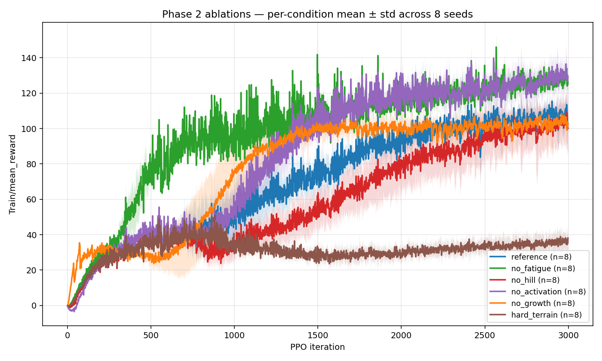
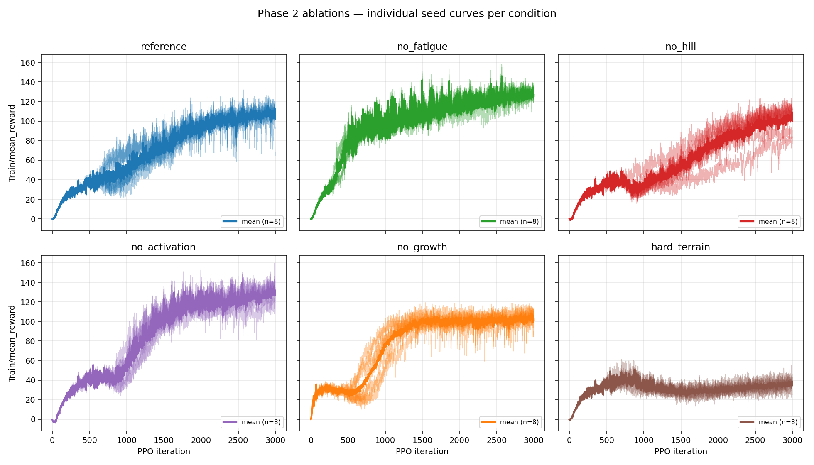

# Phase 2 — Observation & Ablation

**Status: complete (2026-05-27).** Extended from 3 → **8 seeds per condition**
(48 runs total) after the 3-seed numbers turned out to be too statistically
thin to back the original narrative. With the larger sample, two of the
"clear effects" from the 3-seed analysis turn out **not significant** at all
(see Results below). Operational details and the schedule history are in
[`operations.md`](./operations.md).

## Goal

Disable each bio-inspired layer (and harden the terrain) individually and
observe how final reward, behavioural metrics, and learning curve change
versus the [Phase 1 reference](../phase1-reference/). Single-knob overrides so
any difference must come from that knob.

## Ablations

Each is a config-only subclass of `GO2TorqueCfg` (defined in
[`configs/go2_torque_ablations.py`](./configs/go2_torque_ablations.py)) and
registered as a new task in SATA's `envs/__init__.py` (additions in
[`configs/envs_init_additions.txt`](./configs/envs_init_additions.txt)).

| Task name | One-line override | What it tests |
|---|---|---|
| `go2_torque_no_fatigue` | `motor_fatigue=False`, reward scale 0 | Does fatigue feedback drive adaptive load-shedding? |
| `go2_torque_no_hill` | `hill_model=False` | Does the force-velocity drop-off matter for the resulting gait? |
| `go2_torque_no_activation` | `activation_process=False` | Does the activation low-pass tame action smoothness, or is the policy naturally smooth? |
| `go2_torque_no_growth` | `control_type='T'` (pins general_scale≈0.79 from the start, not full development — see note) | Is the growth curriculum necessary for convergence, or just convenience? |
| `go2_torque_hard_terrain` | `terrain_proportions=[0,0.4,0.3,0.3,0]` (60 % stairs) | Does the reference config still converge on out-of-distribution-style terrain? |

> **Note on `no_growth`.** `control_type='T'` forces `step_count = num_steps_per_env × checkpoint = 24 × 3000 = 72000` from the first step ([go2_torque.py:179-183](https://github.com/marmotlab/SATA/blob/8fc422af3fec463a408779b1685c2453d0040be8/legged_gym/legged_gym/envs/go2/go2_torque/go2_torque.py#L179)). The Gompertz curve at step 72000 (k=3e-5, x0=24000) gives **general_scale ≈ 0.79**, not 1.0 — i.e. the robot starts highly but not fully developed (front-torque ceiling ≈ 0.85·τ, control freq ≈ 179 Hz). So this ablation removes the *curriculum* (no gradual ramp) while leaving capability near-max from the start; it is not a "full capability from step 0" condition.

## Launch strategy (adaptive)

A two-round scheduler in [`launch_all.sh`](./launch_all.sh):

1. **Round A — diagnostic**: every ablation with `seed=1`. Two batches of
   3 (no_fatigue/no_hill/no_activation, then no_growth/hard_terrain) on
   GPUs 0/2/3. ~2 hours wall time.
2. **Triage**: each Round A run is classified `OK` / `DID_NOT_FINISH` /
   `FAILED` by scanning its log. "OK" means Python exit 0 and `Learning
   iteration 2999/3000` reached.
3. **Round B — confirmation**: only `OK` ablations get `seed=2` and `seed=3`.
   Up to 5 × 2 = 10 runs in batches of 3 (~3.5 hours). Failed / non-finishing
   ablations are skipped — the log is preserved for inspection.

Worst-case total wall time: ~5.5 hours. GPU 1 is reserved for another tenant
and never used.

## Status / morning summary

Run [`check_status.sh`](./check_status.sh) anytime to print:
- Is the launcher still running?
- Which python train.py processes are alive?
- Live GPU snapshot
- Per-run table: status, final reward, wall time
- Last 8 lines of launcher log

```bash
bash ~/workspace/bio-inspired-adaptive-locomotion/results/phase2-ablation/check_status.sh
```

## Results (8 seeds per condition)

> **Read this first — what these numbers are and are not.** The metric below is
> *training-distribution scalar reward*. The paper motivates the SATA
> bio-inspired mechanisms around **both** early-stage exploration / trainability
> *and* motion smoothness / sim-to-real feasibility (§III-A) — bounded actuator
> torque, smooth activation, fatigue-based thermal protection. On the
> training-reward axis measured here, only the *feasibility* face is visible:
> a constraint that serves sim-to-real will, by construction, often *cost* a
> little training reward in a clean simulator — which is why "ablating it raises
> reward" is the *expected* sign of a working constraint, not evidence the
> mechanism is useless. (The exploration / trainability face the paper leads
> with does not show up on this scalar-reward axis.) The more informative evaluation of these mechanisms is the out-of-distribution
> / feasibility analysis in [`../phase3-bio-claims-and-robustness/`](../phase3-bio-claims-and-robustness/),
> not this table. Treat the numbers here as *characterising the cost of each
> constraint in-distribution*, and read them alongside that caveat.

Final mean reward at iteration 3000, averaged across 8 random seeds per
condition. Significance is Welch's two-sample t-test against the reference
with Satterthwaite-approximated degrees of freedom (different conditions
have very different variance so a pooled-variance test would be wrong).

| Condition | n | Mean ± std | Δ vs ref | % change | Welch t | df | **p** |
|---|--:|---:|---:|---:|---:|---:|---:|
| reference | 8 | **103.9 ± 15.9** | — | — | — | — | — |
| `no_fatigue` | 8 | **125.8 ± 2.8** | +21.9 | +21 % | +3.84 | 7.4 | **0.006 ✱✱** |
| `no_activation` | 8 | **128.3 ± 7.4** | +24.4 | +23 % | +3.94 | 9.9 | **0.003 ✱✱** |
| `no_hill` | 8 | **98.6 ± 13.4** | −5.3 | −5 % | −0.72 | 13.6 | 0.48 (n.s.) |
| `no_growth` | 8 | **102.5 ± 7.3** | −1.4 | −1 % | −0.22 | 9.9 | 0.83 (n.s.) |
| `hard_terrain` | 8 | **35.98 ± 6.1** | −67.9 | −65 % | −11.26 | 9.0 | **<0.001 ✱✱✱** |

### Reward curves (all 48 runs)

Per-condition mean across 8 seeds, ±1 std shaded band. The two surviving
findings (`no_fatigue` and `no_activation` plateau above the reference) and
the dissolved findings (`no_hill`, `no_growth` bands fully overlap the
reference band) are both visible in one picture.



Per-condition view, 8 individual seed curves + bold mean — useful for
spotting outliers and instabilities:



The reference subplot is the noisiest (one seed late-collapses, visible as
the dip near iter 3000); `no_fatigue` is the tightest cluster; `no_hill`
fans out the widest among the bio ablations — which is why the −17 % effect
seen in the 3-seed window did not reach significance at n=8: those three
seeds happened to fall on the lower edge of a wide distribution.

Plots are regenerated from the raw tensorboard event files by
[`../../analysis/plot_phase2_curves.py`](../../analysis/plot_phase2_curves.py)
inside the `sata` conda env (needs `tbparse` + `matplotlib`).

### What changed when we went from 3 → 8 seeds

Our own preliminary 3-seed read suggested *"only Hill model has a clear
positive contribution; no_growth mildly hurts"*. Neither statement held up
under the larger sample — a reminder of how thin n=3 is for RL:

- `no_hill`'s apparent 17 % drop at n=3 became 5 % at n=8, and is statistically
  indistinguishable from reference noise (p = 0.48). The Hill ablation is
  high-variance — two of eight seeds reach 75 / 82, two reach 108 — and the
  3-seed estimate happened to sample the lower tail.
- `no_growth` is similarly noise-level at n=8 (p = 0.83).
- The reference itself is much noisier than the 3-seed estimate suggested:
  std grew from 6 to 16, dominated by seed 7 which trained normally to
  reward ≈ 100 then collapsed to 70 in the final 5 PPO iterations — a
  well-known PPO instability, real seed variance, not a data error
  (see [`operations.md`](./operations.md) § 7).

### What survived

Two effects strengthened with more data:

- **Ablating the activation low-pass raises training reward by +24** (p = 0.003).
  The EMA on activation sign models muscle recruitment delay and bounds how
  fast torque can switch. In a clean simulator a PPO policy does not *need*
  that bound to score well, so removing it lets the policy use a wider
  action bandwidth and score higher. Whether that wider-bandwidth policy is
  physically realisable / transferable is exactly what Phase 3 measures
  (early nominal data already shows ablated policies hitting torque regimes
  beyond the actuator spec).
- **Ablating the motor-fatigue feedback raises training reward by +22** (p = 0.006).
  With the fatigue reward penalty (`-0.05 × Σ|τ| · fatigue`) gone and the
  fatigue observation always zero, the policy is free to use its full torque
  budget continuously — which scores well in-distribution but removes the
  mechanism that, on real hardware, would protect actuators from sustained
  high load.

And one effect remains overwhelming (and unsurprising):

- **Hard-terrain (60 % stairs) reward collapses to ~36** (p < 0.001), about
  one-third of reference. The policy still converges to a non-trivial reward,
  i.e., the recipe transfers without total collapse, but with a much lower
  ceiling.

### Important interpretation caveat

These results are **training-distribution scalar reward only**. They are
**not evidence that the bio-inspired mechanisms are useless**. In particular:

- Training reward does not measure *out-of-distribution robustness* (payload,
  friction shift, terrain shift) — the SATA paper's own §VI-A limitation
  on payload posture is exactly the kind of measurement scalar reward misses.
- Training reward does not measure *gait quality*, *energy efficiency*, or
  *sim-to-real transferability*. The bio mechanisms may matter more on those
  axes than on training reward.
- A higher training reward without these constraints may simply mean the
  policy has exploited the reward more aggressively — which can correlate
  with *worse* real-world behaviour.

Phase 3 treats these ablations as data points under the adaptive-control
lens: *if* the bio constraints are doing something useful, *where in the
behaviour space should we look for the evidence?*  This framing is the
bridge to Phase 4, which evaluates the ablation policies on SATA's own
stated weakness (payload posture, §VI-A) instead of on training reward.

### Statistical methodology

- **n = 8 seeds per condition.** Standard for a small RL paper claim is 5;
  more is better given how high RL seed variance can be (Henderson et al.,
  "Deep RL that Matters", AAAI 2018).
- **Welch's two-sample t-test** with Satterthwaite-approximated df, because
  variances differ substantially across conditions (`no_fatigue` σ ≈ 3,
  reference σ ≈ 16). A pooled-variance test would understate the SE for
  comparisons against the noisy reference.
- **Final-iteration reward** is reported as-is rather than as
  "last-100-iters mean", to match the SATA paper's reporting convention.
  The PPO instability on `ref_s7` is the most extreme case where this
  matters; for `ref_s7` a last-100-iters mean would give ~97 instead of 70.

### Caveats (operational)

- Runs were in parallel batches of 3 sharing the 64-core CPU and one NFS
  volume. Wall times show 10–20 % jitter from environmental contention.
  The original 3-seed `no_fatigue_s1` failure was an extreme case
  (see [`operations.md`](./operations.md) § 6); all retries and the
  full 8-seed extension landed cleanly.

## Related

- [`operations.md`](./operations.md) — chronological record of how Phase 2
  was set up and run.
- [`../phase1-reference/`](../phase1-reference/) — the baseline these
  ablations are compared against.
- [`../../docs/training-internals.md`](../../docs/training-internals.md) —
  what each config knob actually does in the env code.
