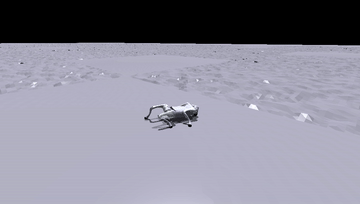
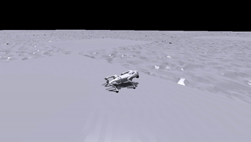
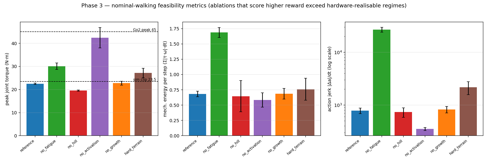
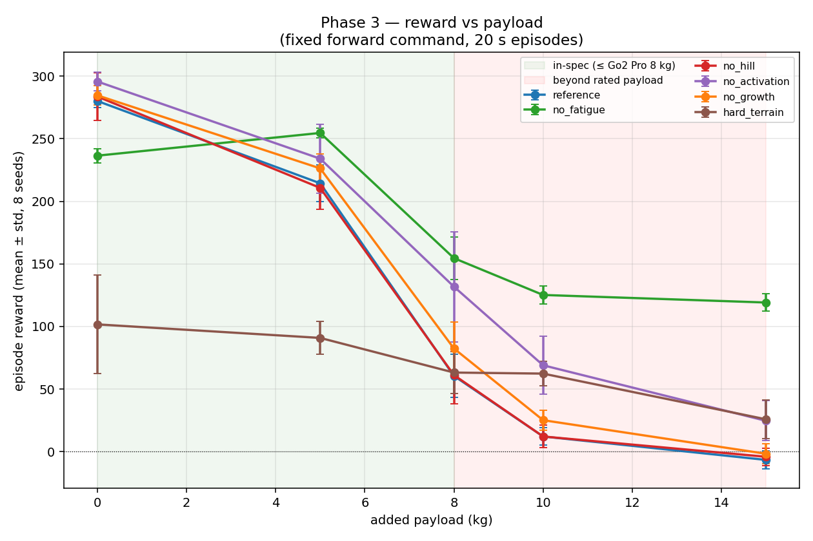
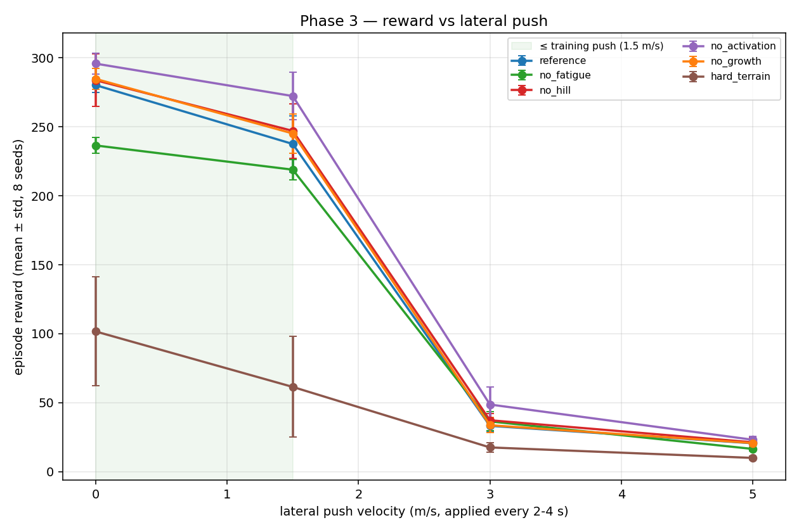

# Phase 3 — Bio-mechanism claims & out-of-distribution robustness

**Status: done (2026-05-29).** All 48 policies (6 conditions × 8 seeds from
Phase 1/2) evaluated under 8 controlled scenarios — 384 evaluation cells,
64 episodes each. Raw data: [`raw_metrics.csv`](./raw_metrics.csv) (6 scenarios)
+ [`raw_metrics_suppl.csv`](./raw_metrics_suppl.csv) (8 kg payload + gentle push).

**Simulation clips** (full gallery + narration in [`videos/`](./videos/)):

| reference, 10 kg payload | no_fatigue, 10 kg payload |
|---|---|
|  |  |
| Goes down — reproduces SATA §VI-A. | Stays up by hardware-infeasible thrashing. |

## Why this phase exists

Phase 2 found that removing the fatigue or activation constraint *raises*
training reward. Taken alone that reading is misleading. The paper frames
these mechanisms around **both** early-stage exploration / trainability *and*
smoothness / feasibility (§III-A) — and this eval can only probe the second.
So *our working interpretation, on the axes we can measure here*, is that the
bio mechanisms behave less like reward devices and more like **feasibility /
safety constraints that keep a sim-trained policy inside what real hardware
can do** (bounded torque, smooth actuation, no sustained thermal overload).
That is a hypothesis about the measured axis, not the paper's stated design
intent. This phase asks the question Phase 2 cannot: *what do those constraints
actually buy, measured on axes other than training reward?*

- **H1 (constraint = feasibility envelope):** the ablated policies win reward
  by operating in regimes a real Unitree Go2 could not sustain (torque beyond
  spec, very high mechanical power, non-smooth actuation). The constraint's
  value is hardware-realisability, invisible to a clean-sim reward.
- **H0 (constraint = pure over-engineering):** ablated policies are simply
  better with no hidden cost.

The reference hardware is the **Unitree Go2**: body mass ~15 kg; rated payload
Air 7 / Pro 8 / EDU 12 kg; peak joint torque **45 N·m** (the SATA sim uses a
conservative 23.5 N·m clip).

## Method

Each policy is evaluated in an env whose **bio-knob configuration matches its
own training** (the `no_fatigue` policy keeps `motor_fatigue=False` in eval,
etc.) — we never put a policy into an env it was not trained for. `use_test=True`
forces `general_scale=1` (fully grown) for all conditions; a fixed forward
command (vx = 1 m/s) via point-range; deterministic policy; no observation
noise; per-scenario point-value domain randomisation. Harness:
[`../../analysis/eval_under_conditions.py`](../../analysis/eval_under_conditions.py).
Plots: [`../../analysis/plot_phase3.py`](../../analysis/plot_phase3.py).

Scenarios: `nominal`; `payload_{5,8,10,15}kg`; `push_x_{1p5,3,5}` (lateral
velocity impulse every 2–4 s). In-spec payloads are 5 and 8 kg; 10/15 kg are
*beyond rated capacity* and are reported only to characterise *how* each
policy degrades, not as robustness evidence.

## Result 1 — nominal feasibility (the main thing we observed)

At nominal walking (no perturbation), mean ± std over 8 seeds. Significance is
Welch's t-test of each ablation against the reference (8 v 8):

| condition | peak torque (N·m) | mech. energy/step | action jerk |
|---|---:|---:|---:|
| reference | 22.5 ± 0.3 | 0.68 ± 0.05 | 782 ± 94 |
| `no_fatigue` | 30.1 ± 1.4 ✱✱✱ | **1.69 ± 0.08** ✱✱✱ (2.5×) | **26 998 ± 2949** ✱✱✱ (35×) |
| `no_hill` | 19.5 ± 0.2 ✱✱✱ (lower) | 0.65 ± 0.26 (n.s.) | 733 ± 147 (n.s.) |
| `no_activation` | **42.5 ± 4.4** ✱✱✱ (≈ Go2 45) | 0.58 ± 0.12 (n.s.) | 351 ± 24 ✱✱✱ (lower) |
| `no_growth` | 22.7 ± 0.8 (n.s.) | 0.69 ± 0.09 (n.s.) | 821 ± 115 (n.s.) |

(✱ p<0.05, ✱✱ p<0.01, ✱✱✱ p<0.001. All "✱✱✱" comparisons have t > 12.)

The two ablations that scored *higher* training reward in Phase 2 each also
leave the hardware-realisable envelope — but via **different** mechanisms, which the
statistics make precise:

- **`no_activation` breaches on peak torque only.** It peaks at 42.5 ± 4.4 N·m
  (p<0.001) — at the real Go2's 45 N·m limit, ~1.8× the sim's own 23.5 N·m
  clip. Its energy is statistically indistinguishable from reference
  (0.58 vs 0.68; two-sided Welch p≈0.05, n.s.) and its action-jerk is *lower*
  (351 vs 782, p<0.001). So the activation low-pass was not making the policy
  smoother (PPO is already smooth); it was **bounding peak torque**. Removing
  it lets PPO command near-saturation torque a real actuator could not hold.
- **`no_fatigue` breaches on sustained power and smoothness.** 2.5× the
  mechanical energy (p<0.001) and 35× the action-jerk (p<0.001), with peak
  torque also up (30.1, p<0.001). Without the fatigue penalty the policy
  thrashes at high sustained power — fine in a thermally-ignorant simulator,
  damaging on real motors.

`no_hill` and `no_growth` are statistically flat against the reference on
energy and jerk (n.s.). `no_hill`'s peak torque is in fact significantly
*lower* (19.5, p<0.001): without the Hill `(1 − sign·ω/ω_max)` term, torque
can no longer transiently overshoot τ_max, so it sits capped below the clip.
This is consistent with Phase 2 finding no_hill and no_growth not significantly
different from reference on reward.

## Result 2 — payload degradation

Reward vs added payload (mean ± std, 8 seeds). Green band = in-spec (≤ Go2
Pro 8 kg); red = beyond rated capacity. `no_fatigue` beats reference at every
payload, all p<0.001 (Welch): Δ +40 (5 kg), +94 (8 kg), +113 (10 kg),
+126 (15 kg).

The discriminating signal is **how long the episode runs before the robot
falls** (episode length, in policy steps). A rollout completed without falling
runs ~3500–3580 steps at the eval control rate (nominal reference 3485 ± 72,
nominal no_fatigue 3551 ± 15 — the robot is walking the whole time, confirmed
by the high nominal reward). A shorter, high-variance length means episodes
are terminating early = the robot is falling. (Note: the harness's `survived`/
`early_terminated` flags were computed against a nominal-dt cap of 4000 steps
that the variable-rate eval rollout never reaches, so they are uninformative;
we read falls off episode length directly, which is valid as a *relative*
measure.)

| payload | reference ep-length | no_fatigue ep-length |
|---|---:|---:|
| 5 kg | 3467 ± 63 | 3578 ± 0 |
| 8 kg | **2994 ± 471** (starts to fall) | 3578 ± 0 |
| 10 kg | **2641 ± 806** (falls) | 3578 ± 0 |
| 15 kg | **2530 ± 845** (falls) | 3578 ± 0 |

- **In-spec (5–8 kg) reproduces SATA §VI-A.** The reference sags from
  height 0.32 → 0.26 (5 kg) → 0.20 (8 kg); at 8 kg its episode length drops to
  2994 ± 471 (large variance = some rollouts **fall** early) and reward drops
  280 → 214 → 60. The paper's stated limitation — "cannot maintain body height
  with a medium payload" — reproduces cleanly at the rated load.
- **Within the payload scenarios `no_fatigue` does not fall** (episode length
  holds at its nominal ~3578 at every payload) and genuinely carries better
  in-sim, not merely "survives". At 8 kg it tracks the forward command *better*
  than reference (velocity error 0.39 vs 0.47) while crouching lower (height
  0.12 vs 0.20). Only at the far-beyond-spec 15 kg (≈ body mass) does it
  degrade to survival-without-progress (velocity error 0.93 — essentially
  stationary but upright). (This "does not fall" is specific to the payload
  axis; under hard lateral push `no_fatigue` falls like everything else —
  Result 3.)
- **The catch — and the link back to Result 1.** `no_fatigue`'s payload
  advantage comes from sustaining the high torque needed to hold a heavy load
  up; that is the *same* sustained-high-power behaviour that shows up as 2.5×
  energy in nominal walking. The reference's §VI-A "failure" is the fatigue
  mechanism **refusing to thermally overload the actuators** to hold a load
  beyond rated capacity. In a simulator with no thermal model, refusing looks
  like a weakness; on real hardware it is the protection the mechanism exists
  for. So the payload result does not contradict H1 — it is H1 seen from the
  load axis: removing the constraint "wins" only because the sim does not
  charge for the thermal cost.

## Result 3 — lateral push

At training-magnitude push (1.5 m/s) every condition holds near nominal
(reference 238, no_activation 272). At 3–5 m/s every condition collapses
together to ~20–50. Push does **not** discriminate the bio mechanisms —
fatigue / activation / hill behave alike under impulse disturbance; the
discriminating axis is sustained load (payload), not impulse. (The original
push_x_3/_5 every-2 s scenarios were too severe to be informative; the gentle
push_x_1p5 was added for this reason.)

## Per-mechanism verdict (against the paper's stated claims)

| Mechanism | SATA's claim | Our measurement (8v8, nominal unless noted) | Verdict |
|---|---|---|---|
| Activation low-pass | "improve motion continuity" | action jerk is *lower* without it (351 vs 782, p<0.001) → PPO is already smooth; the real effect is peak torque 22→42 N·m (p<0.001) | the *smoothing* rationale is not supported in our in-distribution data; the effect we can measure is **bounding peak torque** to a hardware-feasible range |
| Hill model | "limit torque to safe range, suppress rapid/extreme torque" | no_hill peak torque is *lower* (19.5 vs 22.5, p<0.001, capped at clip) not higher; energy & jerk n.s.; ≈ reference under push too | **not detected** on our axes (steady command / impulse / static payload); force-velocity shaping likely matters in high-joint-velocity regimes we did not isolate — "not detected ≠ useless" |
| Motor fatigue | "prevent prolonged high loads" | without it: 2.5× energy (p<0.001), 35× jerk (p<0.001), and it sustains the high torque that lets it hold payload reference refuses to | **well supported on our axes** — the clearest of the three feasibility constraints in our data; consistent with reading the §VI-A "limitation" as thermal-overload refusal (sim-inferred; no thermal model — see caveats) |
| Growth curriculum | "deeper exploration, fewer shortcuts" | deployed policy indistinguishable from reference on every metric (all n.s.) | a *training-process* knob; no footprint in deployed behaviour (consistent with Phase 2 n.s. on reward) — our deployed-policy eval cannot see training dynamics |

## Synthesis

The evidence favours **H1**. The mechanisms that look like "dead weight" on
training reward (fatigue, activation) are precisely the ones holding the
policy inside a hardware-realisable envelope: remove them and the policy
scores higher by commanding near-limit torque (`no_activation`, 42.5 N·m)
or sustained high-power, jerky actuation (`no_fatigue`, 2.5× energy, 35×
jerk) — neither sustainable on a real Go2. This reframes Phase 2's "+22 / +24
reward" not as the ablation being better, but as the simulator failing to
charge for hardware-infeasible behaviour that the constraint otherwise
forbids. Hill model and growth show no footprint on these particular axes —
their value, if any, lies elsewhere (Hill possibly under disturbance regimes
we did not isolate; growth in training dynamics, which a deployed-policy eval
cannot see). Note our deployed eval tested payload / push, not OOD velocity
commands — where the paper's growth-generalization claim (§V-A1, Fig 5b, tested
at 1.8 m/s) actually lives — so we cannot speak to that claim either way.

## Caveats (important — this is a reproduction, not a hardware study)

- **Simulation only — the central inference is indirect.** "Hardware-
  infeasible" is inferred from torque/energy/jerk exceeding Go2 spec, not
  observed on a real robot. The simulator has **no thermal / actuator-wear
  model**, which is exactly why the fatigue ablation can "win" — it is not
  charged for sustained overload. A real sim-to-real test (motor temperature,
  torque-duration limits) is the proper confirmation and is out of scope here.
- **`no_fatigue` genuinely carries better in-sim at in-spec loads** (8 kg:
  better velocity tracking *and* never falls) — it is **not** mere crouch-and-
  survive. The crouch-without-progress reading applies only at the far-beyond-
  spec 15 kg. The honest claim is "more payload-robust in a thermally-ignorant
  simulator", with the thermal caveat above.
- **Action-jerk is `|Δaction|/dt` in policy-action units**; absolute values
  are only meaningful relative to the reference, not as physical jerk.
- **Hill model verdict is "not detected here", not "useless".** Our scenarios
  (steady forward command, impulse push, static payload) may not excite the
  high-joint-velocity regime where force-velocity shaping matters most.
- **8 seeds per cell**, Welch t-tests with unequal variance. Beyond-spec
  payload points (10/15 kg) are descriptive of failure mode, not a capability
  claim. p-values are per-comparison (no multiple-comparison correction);
  the surviving effects have t > 7 so this does not change the conclusions.

## Related

- [`operations.md`](./operations.md) — how the 384-cell grid was run.
- [`../phase2-ablation/`](../phase2-ablation/) — the training-reward ablations
  this phase reinterprets.
- [`../../analysis/eval_under_conditions.py`](../../analysis/eval_under_conditions.py),
  [`../../analysis/plot_phase3.py`](../../analysis/plot_phase3.py),
  [`../../analysis/view_policy.py`](../../analysis/view_policy.py) (live viewer).
