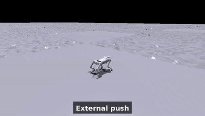
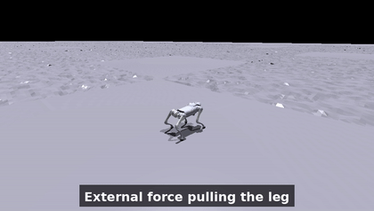
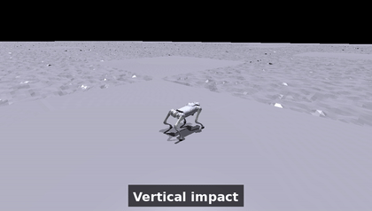
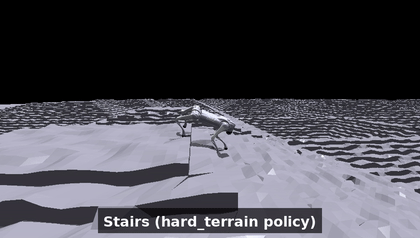

# Phase 3 — simulation clips

Inline GIFs for quick viewing; full-resolution mp4s are kept out of git
(`.gitignore`) and can be linked externally. All clips use a follow-camera and
the reproduced SATA reference policy unless noted. Recorded with
[`../../../analysis/record_demo.py`](../../../analysis/record_demo.py) and
[`../../../analysis/record_video.py`](../../../analysis/record_video.py).

## Compliance under disturbance

Each clip isolates one disturbance, with slow-motion + camera zoom during the
event. The disturbances are **real** sim changes (forces applied via
`apply_rigid_body_force_tensors`, the pulled leg recoloured via
`set_rigid_body_color`); the arrows / rings / labels are **post-hoc overlays**
drawn on each rendered frame (the robot's 3D position projected to 2D screen
coords, see [`overlay.py`](../../../analysis/overlay.py)) so an external force
reads as external rather than as the robot thrashing on its own.

### External push
A lateral force pulse — the robot staggers, stays up, and recovers its gait.

### External force pulling a leg
A persistent external force tugs the front-left leg (recoloured red), like a
hand grabbing it. The robot **resists and keeps balance** — this is an
*external* disturbance it counteracts, not a motor failure.

### Vertical impact
A downward impact on the base — absorbed compliantly, then recovered.

### Stairs (hard_terrain policy)
The `hard_terrain` ablation policy (trained on a stairs-heavy mix) traversing
stepped terrain. Shown with a side view; the reference policy, trained only on
slopes, is out-of-distribution here, so we use the policy that actually learned
stairs.

## Payload — reproduces SATA §VI-A

| reference, 10 kg payload | no_fatigue, 10 kg payload |
|---|---|
|  |  |
| Goes down — reproduces the paper's payload limitation. | Stays up, but by sustaining hardware-infeasible torque (2.5× energy, 35× jerk). |

Reference walking on nominal rough terrain: [`01_reference_nominal.gif`](./01_reference_nominal.gif).

---
See [`../README.md`](../README.md) for the quantitative analysis these clips
illustrate.
