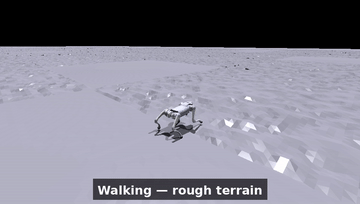
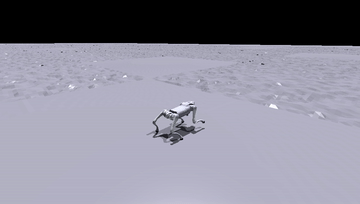
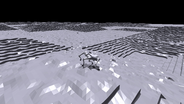

# Phase 3 — simulation clips

Inline GIFs (360 px / 10 fps, trimmed) for quick viewing; the full-resolution
mp4s are kept out of git (`.gitignore`) and can be linked externally. All clips
use a follow-camera; each policy runs in the env matching its own training
config. Recorded with [`../../../analysis/record_video.py`](../../../analysis/record_video.py).

## Compliance under sequential disturbances (the integrated demo)
One continuous rollout of the reference policy: external pushes → single-leg
torque limit (red leg) → vertical impact → low-friction ground, each absorbed
and recovered. Disturbances are real (forces applied in-sim, leg torque really
limited, friction really lowered, leg really recoloured); the arrows / rings /
labels are post-hoc overlays (3D→2D projected onto each frame, see
[`../../../analysis/record_demo.py`](../../../analysis/record_demo.py) +
[`overlay.py`](../../../analysis/overlay.py)) so an external force reads as
external. GIF is a 12 s highlight; the full 22 s mp4 is kept out of git.

## Reference walking (nominal rough terrain)
The reproduced SATA reference policy walking — smooth, compliant gait.

## Reference under 10 kg payload — reproduces SATA §VI-A
Beyond the rated payload, the reference sags and goes down: the fatigue
constraint refuses the sustained torque needed to hold a load this heavy. This
is the paper's own stated limitation, reproduced.

## no_fatigue under the same 10 kg payload
With the fatigue constraint ablated, the policy stays up under the same load —
but it does so by sustaining the high, jerky torque that Phase 3 measures as
hardware-infeasible (2.5× energy, 35× action jerk at nominal). "Stays up" here
is bought with behaviour a real motor could not hold.

## hard_terrain policy (trained on 60 % stairs)
The ablation trained on a stairs-heavy terrain mix, shown walking.

---
See [`../README.md`](../README.md) for the quantitative analysis these clips
illustrate.
