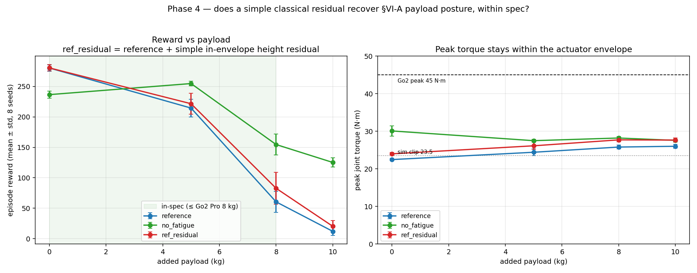

# Phase 4 — Residual compensation (a simple classical add-on)

**Status: done (2026-05-29).** A preliminary boundary-case probe, as scoped in
the project plan ("explore a lightweight residual term, if time allows").

**Simulation clip:** [`videos/`](./videos/) — the residual assisting the frozen
policy under payload, as an inline GIF.

## Question

Phase 3 showed the reference policy fails the SATA §VI-A payload limitation —
it falls under ≥8 kg payload because the fatigue constraint refuses the
sustained torque needed to hold the load, and the only way the ablations
"fixed" it was by removing a bio constraint wholesale (with the nominal
feasibility cost Phase 3 measured: 2.5× energy, 35× jerk, peak torque toward
the actuator limit).

So: **can a simple classical residual `τ_total = τ_SATA + τ_comp`, bolted onto
the frozen reference policy — keeping every bio constraint intact and staying
within the 45 N·m actuator envelope — recover any of the lost payload
capability?**

## The residual controller

A stance-gated PD on body height applied to the calf joints
([`configs/go2_torque_residual.py`](./configs/go2_torque_residual.py),
also in the SATA tree):

```
τ_comp = sign · clip(Kp·(h* − h) − Kd·ḣ, 0, τ_cap)   # only assists when sagging
```

applied **only to legs whose foot is in contact** (stance gating), added
*after* the bio-layer so it is a separate classical channel (it does not pass
through fatigue/Hill). Gains used: `Kp=20, Kd=4, τ_cap=3 N·m, h*=0.32, sign=+1`.
The RL policy is frozen (a reference `ref_sN` checkpoint); nothing is retrained.

**Calibration was necessary and is itself a finding.** A naive *ungated* or
*strong-gain* residual disrupts the gait in *both* sign directions (e.g. strong
`Kp=80, τ_cap=15`: reward 53 < reference 60, height 0.15 < 0.20 at 8 kg) — the
frozen policy cannot observe the residual and treats it as an unmodelled
disturbance. Only **stance gating + gentle gains** give a net benefit.

## Results (8 seeds; reference & no_fatigue from Phase 3 for context)

Reward (mean ± std) and the ref_residual-vs-reference Welch test:

| payload | reference | no_fatigue | **ref_residual** | Δ(resid−ref) | p |
|---|---:|---:|---:|---:|---:|
| nominal | 280.2 | 236.5 | 280.4 | +0.2 | 0.95 (n.s.) |
| 5 kg | 214.4 | 254.7 | 221.6 | +7.1 | 0.39 (n.s.) |
| 8 kg | 60.5 | 154.6 | **82.7** | +22.3 | 0.068 (n.s.) |
| 10 kg | 12.1 | 125.2 | 20.3 | +8.3 | 0.071 (n.s.) |

p is the two-sided Welch test (unequal variance) of ref_residual vs reference,
n=8 seeds each. The 8 kg and 10 kg gains are positive but **not significant at
α=0.05** (p≈0.07); a one-sided test would put them at p≈0.034/0.035, but we
report the two-sided value as the honest default. Treat the payload recovery as
a **suggestive trend, not an established effect**.

Peak joint torque (N·m; real Go2 limit 45):

| payload | reference | ref_residual | no_fatigue |
|---|---:|---:|---:|
| nominal | 22.5 | 24.0 | 30.1 |
| 8 kg | 25.8 | 27.7 | 28.2 |
| 10 kg | 26.0 | 27.7 | 27.6 |



## Honest verdict

- **The residual is inert when not needed.** At nominal it is statistically
  identical to the reference (Δ+0.2, p=0.95): with the body at target height the
  error term is ~0, so almost no residual torque is added. A compensator that
  does no harm in the normal regime is the minimum bar, and it clears it.
- **It gives a small positive trend at the rated payload**
  (8 kg: +22 reward, +37 %; 10 kg: +8). But with n=8 and high seed variance the
  two-sided Welch test is **not significant** (p≈0.068 / 0.071) — suggestive at
  best, not an established effect.
- **It stays firmly within the actuator envelope** (+~2 N·m over reference;
  ≤28 N·m vs the 45 N·m limit), unlike the no_activation ablation (42.5 N·m at
  nominal). It also keeps *every* bio constraint, unlike no_fatigue which
  removes one wholesale.
- **But it recovers only ~1/4 of the gap.** At 8 kg the residual reaches 83 vs
  no_fatigue's 155 and reference's 60. A bolt-on classical term cannot do more,
  because — as the calibration showed — the **frozen policy treats the residual
  as a disturbance**; only gains too gentle to disturb the learned gait are
  usable, which caps the help.

## So what (and the bridge to future work)

A simple, hand-tuned, hardware-safe classical residual *does* recover some of
the payload capability SATA trades away for safety — without retraining and
without removing any constraint — but only modestly, and the ceiling is set by
the lack of co-design between the learned policy and the classical add-on. This
is exactly the gap that **RL-with-online-adaptation** methods close by *learning*
the adaptation jointly (e.g. RL2AC, RSS 2024). Our result motivates that line; it
does not deliver it. See the control-theoretic reading in
[`../../docs/control-perspective.md`](../../docs/control-perspective.md) (Q5).

## Caveats

- Improvements are a positive trend but **not significant** (two-sided Welch
  p≈0.068–0.071) with high seed variance; treat as preliminary boundary-case
  evidence, not an established effect.
- Gains were hand-tuned on seed 1 at 8 kg, then fixed across all seeds/payloads
  — not separately optimised per payload (a fixed controller, by design).
- Simulation only; "within envelope" = within the rated torque number, not
  hardware-validated (same caveat as Phase 3).
- The residual acts on calf joints with an empirically-calibrated sign; it is a
  deliberately simple compensator, not a principled inverse-dynamics / Jacobian
  design.

## Reproduce

```bash
source ~/workspace/bio-inspired-adaptive-locomotion/scripts/sata-env.sh
cd ~/workspace/bio-inspired-adaptive-locomotion
python analysis/eval_under_conditions.py \
  --batch-csv results/phase4-residual-compensation/raw_residual.csv \
  --conditions ref_residual --seeds 1 2 3 4 5 6 7 8 \
  --scenarios nominal payload_5kg payload_8kg payload_10kg \
  --gpu 0 --episodes 64 --num-envs 64 \
  --residual-sign 1.0 --residual-kp 20 --residual-kd 4 --residual-tau-cap 3
python analysis/plot_phase4.py
```
