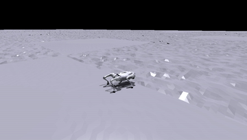

# Phase 4 — simulation clip

Inline GIF (360 px / 10 fps, trimmed); full-res mp4 kept out of git. Recorded
with [`../../../analysis/record_video.py`](../../../analysis/record_video.py).

## Reference + classical height residual, 8 kg payload
The frozen reference policy with the stance-gated height-PD residual
(`τ_total = τ_SATA + τ_comp`, Kp=20 / Kd=4 / cap=3 N·m) active. The residual
adds a few N·m on the stance-leg calves only when the body sags, helping hold
posture under the rated payload while staying inside the actuator envelope.
See [`../README.md`](../README.md) for the quantitative (and appropriately
hedged) results.

