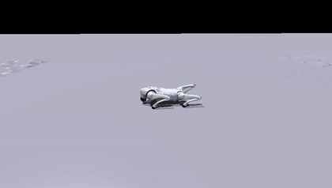

# Phase 5 — A trainability side note

**Status: a small follow-up, not a headline.** While re-reading the SATA paper
([arXiv:2502.12674](https://arxiv.org/abs/2502.12674), §V-A1), we noticed its
ablation framing is about *trainability* — the paper reports that "SATA w/o
biomechanical model" is "completely unable to learn a coherent gait." Our
Phase 2 ablations had only ever removed one biomechanical knob at a time, so we
ran the all-three-off case once to see what it looks like in this codebase.

## What we ran

`go2_torque_no_biomech` — activation, Hill, and fatigue all off at once, growth
kept on (config in
[`../phase2-ablation/configs/go2_torque_ablations.py`](../phase2-ablation/configs/go2_torque_ablations.py)),
5 seeds, same 3000 iters / 4096 envs as the reference.

| | mean reward (n=5) | std |
|---|---:|---:|
| reference | 103.9 | 15.9 |
| `no_biomech` | 138.6 | 4.2 |

The resulting policy walks and tracks the velocity command; posture and contact
pattern are close to the reference:

## Why we did not push this further

Two things make this **not** a clean comparison against the paper's result, so
we are recording it as an observation rather than a claim either way:

1. **Our knobs degenerate the pipeline to scaled raw torque.** With all three
   flags off, `_compute_torques` reduces to `torques = actions · action_scale`
   (the `tanh·τ_limit` activation envelope and the Hill term cancel). That is a
   specific, benign re-parameterisation — not necessarily the same baseline the
   paper used. The paper does not give equations or code for its "w/o
   biomechanical model" variant, and the public repo
   ([marmotlab/SATA](https://github.com/marmotlab/SATA)) ships only the full
   model, so the two cannot be lined up exactly.
2. **Reset pose.** The paper describes resetting "lying flat on the ground";
   the public config resets to an upright low crouch. Starting basin matters for
   a trainability question.

Given both, more runs (raw torque with growth also off, a lying-flat reset,
etc.) would only characterise *our* variants — they could not resolve what the
paper's specific baseline does. We stopped here.

Full paper text used for this comparison is archived at
[`../../docs/reference/sata_paper_v2_extracted.txt`](../../docs/reference/sata_paper_v2_extracted.txt).

## Files

- [`run_no_biomech.sh`](./run_no_biomech.sh) — the training launcher (5 seeds, single GPU, serial)
- `logs/` — per-seed training logs
- `videos/` — recorded walking clip
